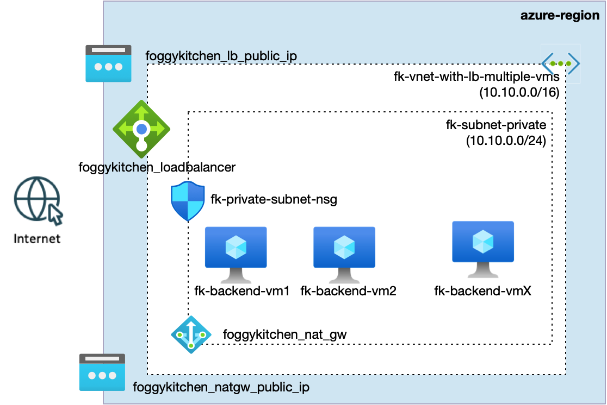
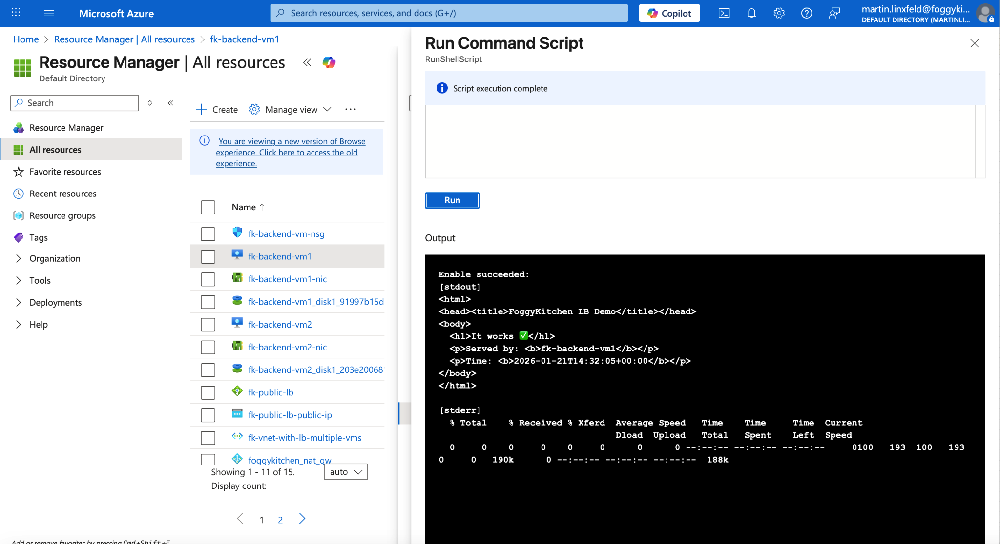
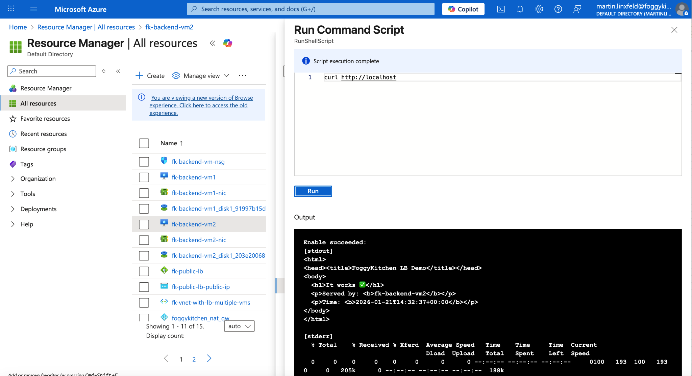
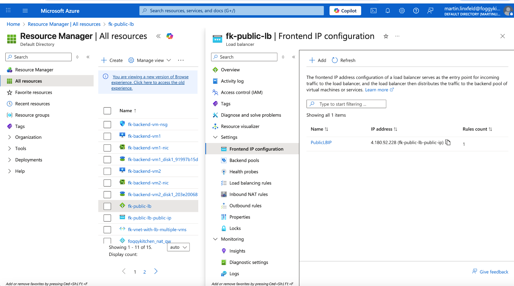

# Example 01: Public Azure Load Balancer with Multiple Virtual Machines

This example demonstrates how to deploy a **public Azure Load Balancer**
distributing traffic across **multiple Linux Virtual Machines** using
**Terraform / OpenTofu**.

The goal of this example is not high availability tuning or autoscaling.
It focuses on one core concept:

> **A Load Balancer is a separate Azure resource that routes traffic to independently managed compute instances.**

---

## 🧭 Architecture Overview



*Figure 1. Public Azure Load Balancer distributing inbound traffic to multiple backend Virtual Machines.*

This deployment includes:

- One **Virtual Network** with a private subnet
- Two **Linux Virtual Machines** (backend instances)
- One **Public Azure Load Balancer**
- A **public frontend IP**
- A **backend address pool** with VM NICs attached
- A **TCP health probe**
- A single **load balancing rule** (TCP/80 → TCP/80)

Each VM runs an identical NGINX service but remains an **independent compute unit**.

---

## 🎯 Why this example exists

Before introducing:

- VM Scale Sets,
- autoscaling rules,
- Application Gateways,
- or Kubernetes Ingress,

it is critical to understand **raw Azure Load Balancer semantics**.

This example teaches:

- That a Load Balancer is **not part of a VM**
- How backend pools attach to **NICs**, not to VMs directly
- How health probes determine traffic eligibility
- Why load balancing should be treated as **infrastructure**, not application logic

This is the **foundation** for all higher-level Azure traffic distribution patterns.

---

## 🚀 Deployment Steps

From the example directory:

```bash
tofu init
tofu plan
tofu apply
```

After a successful apply, Terraform will output the **public IP address**
of the Load Balancer.

---

## 🖼️ Azure Portal & Runtime Verification

### Backend VM 1 – Local Verification



*Figure 2. Local NGINX response served directly by backend VM 1.*

This confirms that the service is running **locally on the VM**, independent of the Load Balancer.

---

### Backend VM 2 – Local Verification



*Figure 3. Local NGINX response served directly by backend VM 2.*

Both backend instances are functionally identical.

---

## 🌐 Public Load Balancer – Azure View

The Azure Portal clearly shows the public entry point for incoming traffic.



*Figure 4. Azure Public Load Balancer frontend IP configuration exposing a single public IP address.*

---

### Public Load Balancer – Traffic Distribution


*Figure 4. Public Load Balancer distributing requests across backend VMs.*

Refreshing the browser shows alternating responses:

- `Served by: fk-backend-vm1`
- `Served by: fk-backend-vm2`

This confirms correct backend pool attachment and health probe operation.

---

## 🧹 Cleanup

When finished, remove all resources:

```bash
tofu destroy
```

---

## 🪪 License

Licensed under the **Universal Permissive License (UPL), Version 1.0**.
