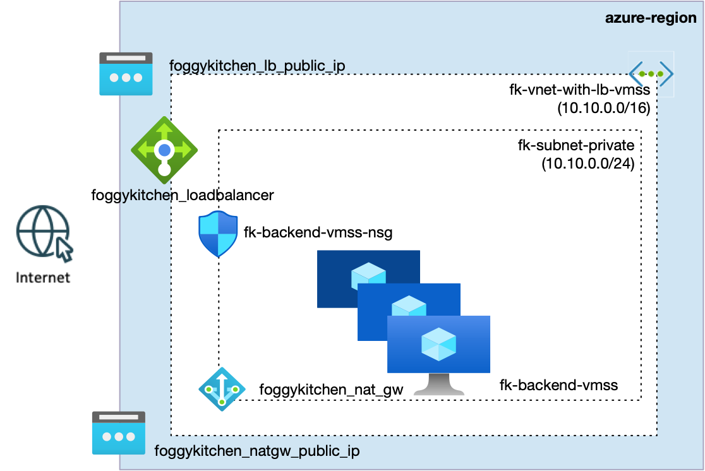
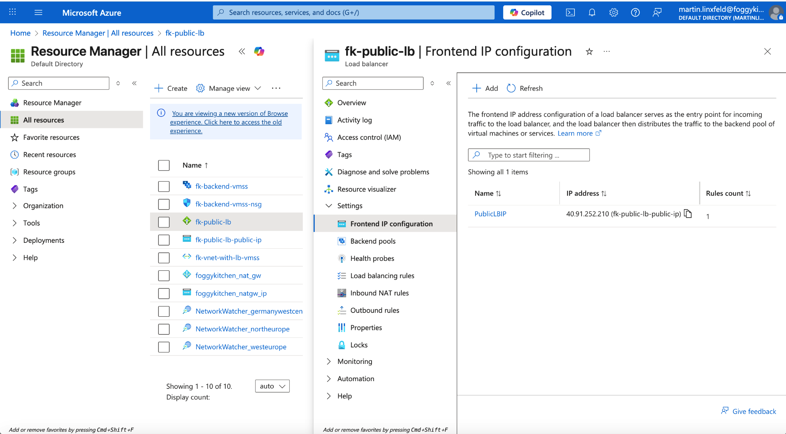
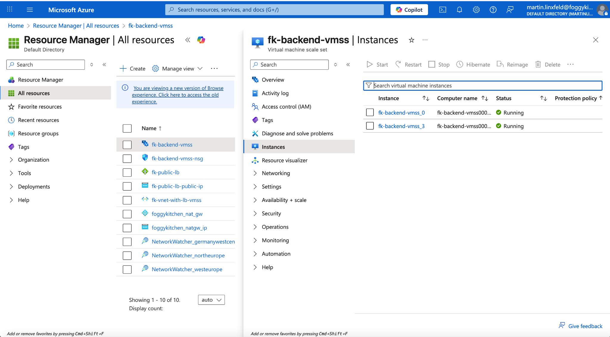
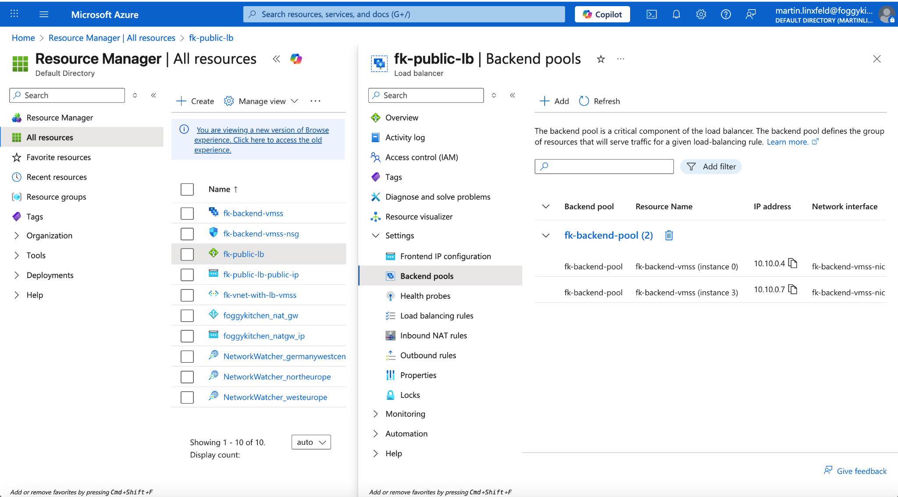
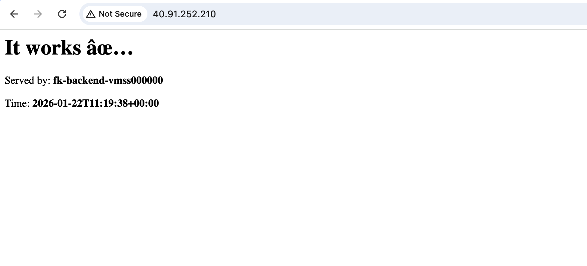

# Example 02: Public Azure Load Balancer with VM Scale Set (VMSS)

This example demonstrates how to provision a **public Azure Load Balancer**
fronting a **Virtual Machine Scale Set (VMSS)** using **Terraform / OpenTofu**.

Unlike Example 01 (multiple standalone VMs), this setup shows the **same load‑balancing model**
applied to a **scalable compute layer**, where instances are created, removed,
and managed automatically by Azure.

The core idea remains unchanged:

> **Azure Load Balancer distributes traffic to a backend pool — whether that pool contains VMs or a VM Scale Set.**

---

## 🧭 Architecture Overview



*Figure 1. Public Azure Load Balancer distributing HTTP traffic to a backend VM Scale Set deployed in a private subnet.*

This deployment includes:

- One **Virtual Network** with a private subnet
- One **Public Azure Load Balancer (Standard SKU)**
- One **Frontend Public IP**
- One **Backend Address Pool**
- One **Health Probe (TCP/80)**
- One **Load Balancing Rule (HTTP/80)**
- One **VM Scale Set** running Linux + NGINX
- A **NAT Gateway** for outbound internet access

All VMSS instances are automatically registered in the Load Balancer backend pool.

---

## 🎯 Why this example exists

After understanding:

- how Load Balancer backend pools work with individual VMs (Example 01),

the next logical step is to see:

- how **the same model scales horizontally** using VMSS.

This example teaches:

- That **Load Balancer configuration does not change** when switching from VMs to VMSS
- How VMSS instances are **dynamically added to backend pools**
- How autoscaling works **without touching the Load Balancer**
- Why Load Balancer + VMSS is the foundational pattern for Azure compute platforms

This is the bridge between **single‑VM designs** and **platform‑level architectures** (AKS, PaaS backends, etc.).

---

## 🚀 Deployment Steps

From the example directory:

```bash
tofu init
tofu plan
tofu apply
```

After a successful apply, Terraform will output the **public IP address**
of the Azure Load Balancer.

---

## 🖼️ Azure Portal Verification

### Load Balancer Frontend IP



*Figure 2. Public frontend IP configuration of the Azure Load Balancer.*

This IP is the **single entry point** for all inbound traffic.

---

### VM Scale Set Instances



*Figure 3. VM Scale Set instances automatically created and managed by Azure.*

Notice that:

- Instance names are generated automatically
- Instances can scale in/out without LB changes

---

### Backend Pool Membership



*Figure 4. VMSS instances registered dynamically in the Load Balancer backend pool.*

Each VMSS instance appears as a backend target with its private IP.

---

## 🌐 Traffic Distribution Verification



*Figure 5. Browser requests routed through the Load Balancer to different VMSS instances.*

Refreshing the page shows alternating responses such as:

- `Served by: fk-backend-vmss000000`
- `Served by: fk-backend-vmss000003`

This confirms:

- Health probes are working
- Load balancing is active
- Traffic is evenly distributed across VMSS instances

---

## 🧹 Cleanup

When finished, remove all resources:

```bash
tofu destroy
```

---

## 🪪 License

Licensed under the **Universal Permissive License (UPL), Version 1.0**.
